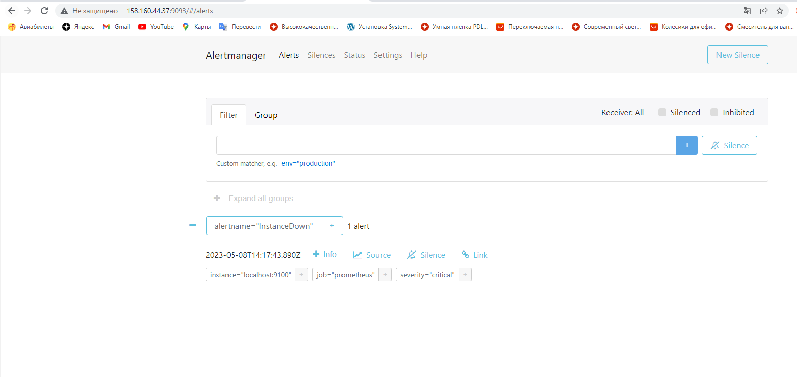
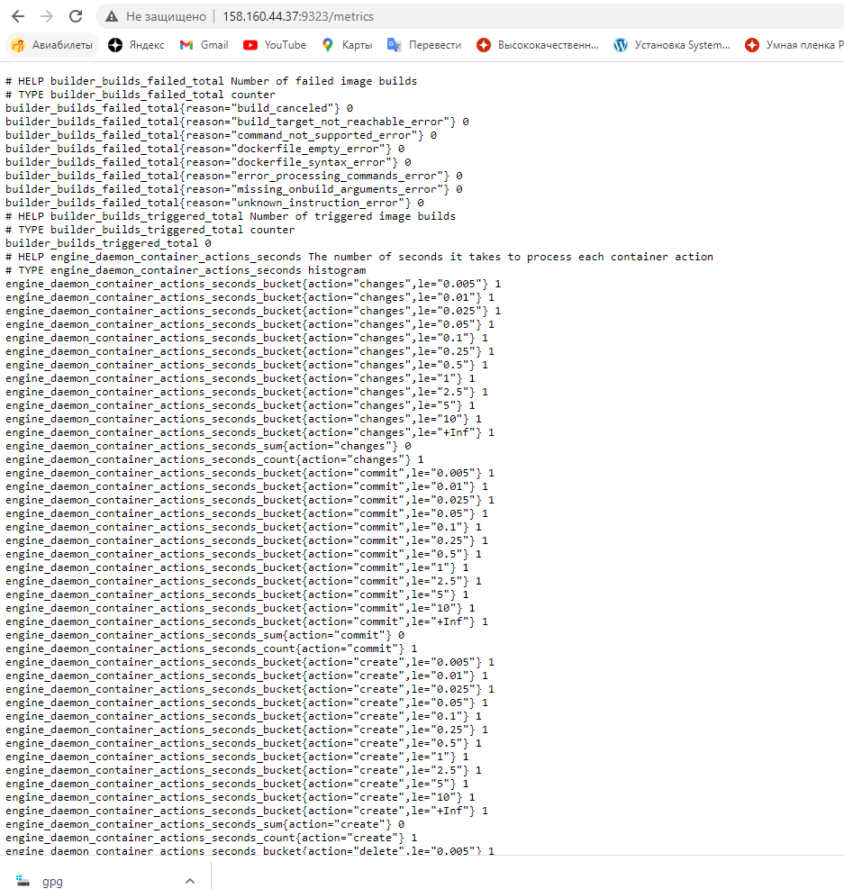
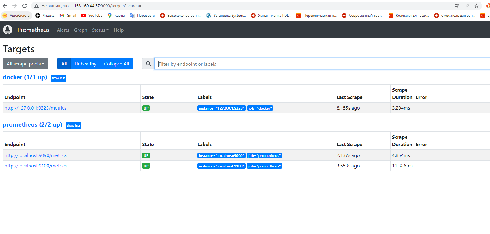

# Домашнее задание к занятию «Prometheus. Часть 2»

В практике есть 3 основных и 1 дополнительное (со звездочкой) задания. Основные задания нужно выполнять обязательно, со звездочкой - по желанию и его решение никак не повлияет на получение вами зачета по этому домашнему заданию, при этом вы сможете глубже и/или шире разобраться в материале. 

Пожалуйста, присылайте на проверку все задачи сразу. Любые вопросы по решению задавайте в чате учебной группы.

### Цели задания
1. Научитья настраивать оповещения в Prometheus
2. Научиться устанавливать Alertmanager и интегрировать его с Prometheus
3. Научиться активировать экспортёр метрик в Docker и подключать его к Prometheus.
4. Научиться создавать дашборд Grafana

### Чеклист готовности к домашнему заданию
- [ ] Просмотрите в личном кабинете занятие "Система мониторинга Prometheus. Часть 2" 

### Инструкция по выполнению домашнего задания

1. Сделайте fork [репозитория c шаблоном решения](https://github.com/netology-code/sys-pattern-homework) к себе в Github и переименуйте его по названию или номеру занятия, например, https://github.com/имя-вашего-репозитория/gitlab-hw или https://github.com/имя-вашего-репозитория/8-03-hw).
2. Выполните клонирование этого репозитория к себе на ПК с помощью команды `git clone`.
3. Выполните домашнее задание и заполните у себя локально этот файл README.md:
   - впишите вверху название занятия и ваши фамилию и имя;
   - в каждом задании добавьте решение в требуемом виде: текст/код/скриншоты/ссылка;
   - для корректного добавления скриншотов воспользуйтесь инструкцией [«Как вставить скриншот в шаблон с решением»](https://github.com/netology-code/sys-pattern-homework/blob/main/screen-instruction.md);
   - при оформлении используйте возможности языка разметки md. Коротко об этом можно посмотреть в [инструкции по MarkDown](https://github.com/netology-code/sys-pattern-homework/blob/main/md-instruction.md).
4. После завершения работы над домашним заданием сделайте коммит (`git commit -m "comment"`) и отправьте его на Github (`git push origin`).
5. Для проверки домашнего задания преподавателем в личном кабинете прикрепите и отправьте ссылку на решение в виде md-файла в вашем Github.
6. Любые вопросы задавайте в чате учебной группы и/или в разделе «Вопросы по заданию» в личном кабинете.

---

### Задание 1
Создайте файл с правилом оповещения, как в лекции, и добавьте его в конфиг Prometheus.

### Требования к результату
- [ ] Погасите node exporter, стоящий на мониторинге, и прикрепите скриншот раздела оповещений Prometheus, где оповещение будет в статусе Pending

Создаем правило
```
sudo nano /etc/prometheus/netology-prometheus.yml
sudo chown -R prometheus:prometheus /etc/prometheus/netology-prometheus.yml
```
Содержимое правила
```
groups: # Список групп
- name: netology-prometheus # Имя группы
  rules: # Список правил текущей группы
  - alert: InstanceDown # Название текущего правила
    expr: up == 0 # Логическое выражение
    for: 1m # Сколько ждать отбоя предупреждения перед отправкой оповещения
    labels:
      severity: critical # Критичность события
    annotations: # Описание
      description: '{{ $labels.instance }} of job {{ $labels.job }} has been down for more than 1 minute.' # Полное описание алерта
      summary: Instance {{ $labels.instance }} down # Краткое описание алерта
```
Подключаем правила
```
sudo nano /etc/prometheus/prometheus.yml #Содержимое файла ниже в блоке кода
sudo systemctl restart prometheus
sudo systemctl status prometheus
sudo systemctl status node-exporter
sudo systemctl stop node-exporter
```
Содержимое prometheus.yml
```

global:
  scrape_interval: 15s # Set the scrape interval to every 15 seconds. Default is every 1 minute.
  evaluation_interval: 15s # Evaluate rules every 15 seconds. The default is every 1 minute.
  # scrape_timeout is set to the global default (10s).

# Alertmanager configuration
alerting:
  alertmanagers:
    - static_configs:
        - targets:
          # - alertmanager:9093

# Load rules once and periodically evaluate them according to the global 'evaluation_interval'.
rule_files:
  - "netology-prometheus.yml"
  # - "first_rules.yml"
  # - "second_rules.yml"

# A scrape configuration containing exactly one endpoint to scrape:
# Here it's Prometheus itself.
scrape_configs:
  # The job name is added as a label `job=<job_name>` to any timeseries scraped from this config.
  - job_name: "prometheus"
    scrape_interval: 5s
    # metrics_path defaults to '/metrics'
    # scheme defaults to 'http'.

    static_configs:
      - targets: ['localhost:9090', 'localhost:9100']
```

---

### Задание 2
Установите Alertmanager и интегрируйте его с Prometheus.

### Требования к результату
- [ ] Прикрепите скриншот Alerts из Prometheus, где правило оповещения будет в статусе Fireing, и скриншот из Alertmanager, где будет видно действующее правило оповещения

```
wget https://github.com/prometheus/alertmanager/releases/download/v0.25.0/alertmanager-0.25.0.linux-386.tar.gz
tar -xvf alertmanager-0.25.0.linux-386.tar.gz 
sudo cp alertmanager-0.25.0.linux-386/alertmanager /usr/local/bin
sudo cp alertmanager-0.25.0.linux-386/amtool /usr/local/bin
sudo cp alertmanager-0.25.0.linux-386/alertmanager.yml /etc/prometheus
sudo chown -R prometheus:prometheus /etc/prometheus/alertmanager.yml
sudo nano /etc/systemd/system/prometheus-alertmanager.service #Содержимое файла ниже в блоке кода
sudo systemctl enable prometheus-alertmanager
sudo systemctl start prometheus-alertmanager
sudo systemctl status prometheus-alertmanager
sudo journalctl -xeu prometheus-alertmanager.service
```
Содержимое prometheus-alertmanager.service
```
[Unit]
Description=Alertmanager Service
After=network.target
[Service]
EnvironmentFile=-/etc/default/alertmanager
User=prometheus
Group=prometheus
Type=simple
ExecStart=/usr/local/bin/alertmanager \
--config.file=/etc/prometheus/alertmanager.yml \
--storage.path=/var/lib/prometheus/alertmanager $ARGS
ExecReload=/bin/kill -HUP $MAINPID
Restart=on-failure
[Install]
WantedBy=multi-user.target
```
Подключаем Prometheus к Alertmanager
```
sudo nano /etc/prometheus/prometheus.yml #В секцию alerting -> alertmanagers -> static_configs -> static_configs вписываем строку - localhost:9093
sudo systemctl restart prometheus.service
sudo systemctl status prometheus.service
```


---

### Задание 3

Активируйте экспортёр метрик в Docker и подключите его к Prometheus.

### Требования к результату
- [ ] приложите скриншот браузера с открытым эндпоинтом, а также скриншот списка таргетов из интерфейса Prometheus.*
```
# Устанавливаем Docker
curl -fsSL https://get.docker.com -o get-docker.sh
sh get-docker.sh
sudo usermod -aG docker root
sudo systemctl status docker

# Включаем выгрузку данных на хосте с Docker
sudo nano /etc/docker/daemon.json #Содержимое файла ниже в блоке кода
sudo systemctl restart docker
sudo systemctl status docker
```
Содержимое файла daemon.json
```
{
 "metrics-addr" : "0.0.0.0:9323",
 "experimental" : true
}
```
Добавляем endpoint Docker в Prometheus
```
sudo nano /etc/prometheus/prometheus.yml 
#В секцию  scrape_configs-> добавляем
  - job_name: 'docker'
         # metrics_path defaults to '/metrics'
         # scheme defaults to 'http'.

    static_configs:
      - targets: ['127.0.0.1:9323']


sudo systemctl restart prometheus.service
sudo systemctl status prometheus.service
sudo systemctl start node-exporter.service
sudo systemctl status node-exporter.service
```


---

### Задание 4* со звездочкой 

Создайте свой дашборд Grafana с различными метриками Docker и сервера, на котором он стоит.

### Требования к результату
- [ ] Приложите скриншот, на котором будет дашборд Grafana с действующей метрикой

## Критерии оценки
1. Выполнено минимум 3 обязательных задания
2. Прикреплены требуемые скриншоты
3. Задание оформлено в шаблоне с решением и опубликовано на GitHub
